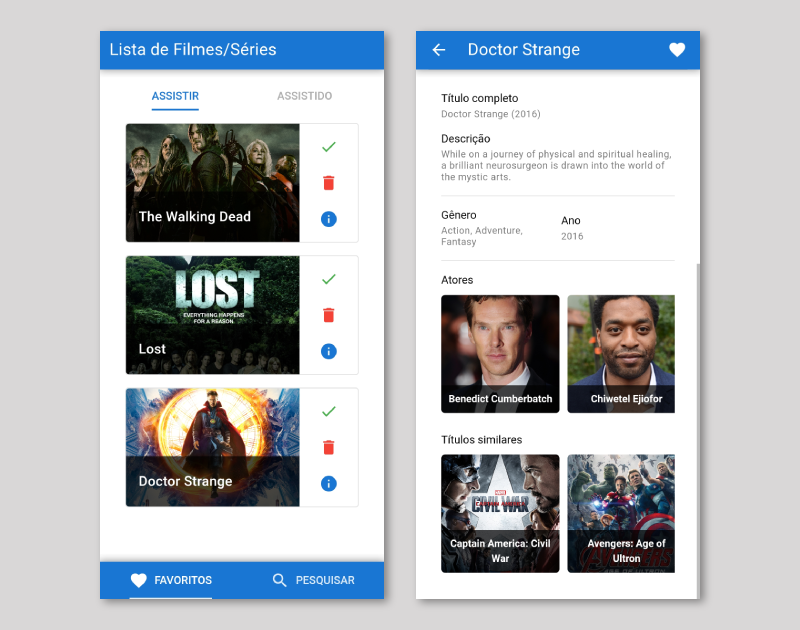

# Lista de Filmes/Séries

[](https://vitejs.dev/) [](https://vuejs.org/) [](https://capacitorjs.com/)

Uma lista de filmes e séries favoritas, pesquise através da API do IMDB e veja os resultados que você pode adicionar para lembrar de assistir mais tarde.

## 🎬 <a href="https://movielist.foxtag.com.br" target="_blank">Ver a Desmonstração</a>

 <p align="center">
  <a src="https://movielist.foxtag.com.br" target="_blank"></a>
</p>

## ❓ Intuito do projeto

Eu montei esse projeto apenas para estudar e manter ativo no portfólio, espero que assim como os muitos projetos que ja encontrei aqui me ajudaram, esse projeto possa ajudar você também :)

## ⚠️ Aviso

O Projeto ainda não está concluído, está em fase de desenvolvimento por se tratar de um projeto para estudo.

## ⚙️ Funcionalidades

- [x] Tela Inicial

  - [x] Listagem dos títulos para assistir
  - [x] Listagem dos títulos já assistidos
  - [x] Alternar status entre títulos para assistir e assistidos
  - [x] Apagar títulos
  - [x] Visualizar detalhes do título
  - [ ] Ordenar itens da lista para assistir

- [x] Tela de pesquisa

  - [x] Pesquisar títulos pela API do IMDB
  - [x] Listar os títulos disponíveis
  - [x] Adicionar título na lista
  - [x] Armazenar a última consulta como histórico

- [x] Tela de detalhes
  - [x] Visualizar informações detalhadas do título
  - [x] Visualizar títulos semelhantes
  - [x] Visualizar atores do título
  - [x] Adicionar título na lista

---

## 🚀 Vamos começar?

Caso deseje testar este projeto, siga os passos abaixo!

```bash

# Primeiro clone este repositório
  $  git clone https://github.com/linhous/favorite_movies.git

# Entre na pasta do projeto
  $  cd favorite_movies

# Execute o yarn para instalar as dependências
  $  yarn

# Agora iniciei o server para testar em modo web
  $  yarn dev

# Não esqueça de informar a chave para consulta da API no IMDB
# O registro é grátis com uma limitação de requisições diárias
```
